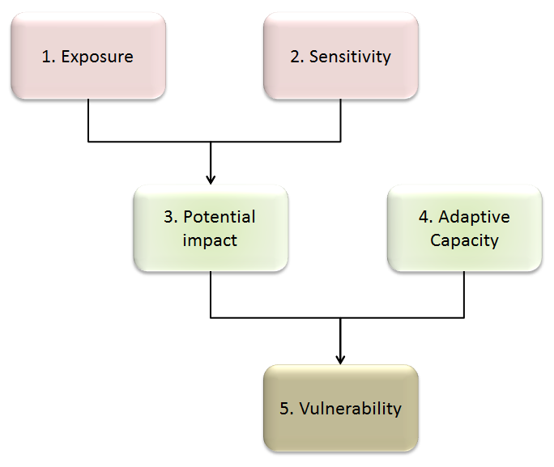

# Methodology

## Future climate scenarios

In order to assess vulnerability to climate change, we used future climate scenarios to look at predicted climate change impacts based on projected future changes in human greenhouse gas emissions. The scenarios we used are two of the Representative Concentration Pathways (RCPs) from the most recent UK Climate Projections 2018 (UKCP18):

- RCP 4.5, which assumes that emissions peak in approximately 2040 before slowly declining
- RCP 8.5, which assumes that emissions continue to rise throughout the century.

We used the probabilistic projections for the six 25km grid squares that cover the PDNP.

Both scenarios are consistent in their broad projected trends, which are for hotter, drier summers and warmer, wetter winters. However, the further into the future we look, the greater the divergence between the scenario forecasts and the lower the certainty of these projections. We remained mindful of this throughout the assessment process when forecasting into the future.

We also used headline figures from UKCP18 to make assumptions that extreme weather events – heat, drought, rainfall and coastal water events – will become more frequent and severe and that average sea levels will rise.

More information on this can be found in Appendix 1.

## Vulnerability

To assess the overall vulnerability of the features, we assessed four factors:

- the **current condition** of the feature
- the **sensitivity** of the feature to climate change
- the **exposure** of the feature to climate change
- the **adaptive capacity** of the feature.

These are drawn from the widely accepted definition of vulnerability, set out by the Intergovernmental Panel on Climate Change (IPCC). Figure 1 shows how these four factors combine to create vulnerability.

_Figure 1.Diagram showing components of vulnerability (after Glick, et al., 2011)_

For a more detailed description of vulnerability, see appendix 2.

## Thresholds

We know that climate change impacts will occur both continuously and as step changes when critical thresholds are reached. However, we were unable to identify specific thresholds for change and link them to specific dates, locations or RCP scenarios due to the wide scope of this assessment, the variations of future projections and incomplete knowledge on most of the features being assessed.

Instead, we consulted pre-existing climate change impact models and asked a panel of internal and external specialists to comment on likely general trajectories of change into the remainder of the century, and we only predicted step-changes where possible.

## Certainty and likelihood

The vulnerability assessment looked at the certainty of impacts that may potentially occur. Certainty in this context differs from likelihood and reflects our confidence that a particular impact could exist. So, certainty here is a measure of the strength and consensus of the research on which an assumption about a potential impact is based. Likelihood, in the context of this report, is the chance that a potential impact would take place and it is often difficult to determine. Therefore, we took a precautionary approach and, while we still considered impacts that were seen as less likely, the likelihood itself did not affect the rating.

## Vulnerability assessment approach

In order to measure overall vulnerability for all features in the most robust way possible, we took a semi-quantitative approach based on the Climate Change Vulnerability Assessment Tool for Coastal Habitats system developed by Plunket _et al_ in 2015. This is a system of scoring for current condition, sensitivity-exposure (i.e. potential impact), adaptive capacity and certainty. It breaks down sensitivity, exposure and adaptive capacity into sub-categories that can be scored individually, ensuring that all features assessed are treated in a consistent and comparable way. This allowed us to compare the disparate PDNP features, which include both living and non-living features.

*Figure 2 illustrates the sub-categories used with our assessment. The definitions and descriptions of these categories and the scoring used can be found as in appendix 3.*